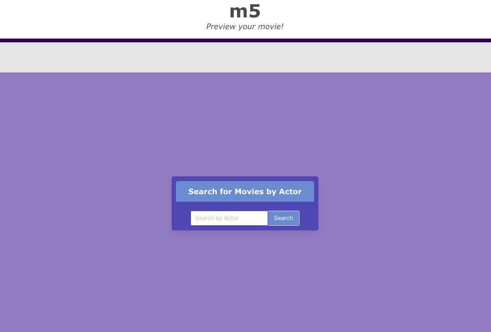

# m5

## Description
The m5 website is designed to provide quick movie trailers for users to sample by searching by actor.
test.....
## USER STORY

AS a movie fan I want to search actors and find their trailers
SO THAT I can watch trailers of the movies they've been in

## Tasks Completed
* Added index.html, CSS, and JS files
* Added CSS design and html code using the Bulma framework 

## Links
* [Link to the deployed website](https://michvalenz.github.io/m5/)
* [Link to the code repository](https://github.com/MichValenz/m5)

## Installation
Upload all files, including index.html and style.css

## References and Tutorials
- [https://imdb-api.com/]
- [https://developers.google.com/youtube/v3]
- [https://bulma.io/documentation/overview/]

## License
MIT License

Copyright (c) [2021] [m3]

Permission is hereby granted, free of charge, to any person obtaining a copy
of this software and associated documentation files (the "Software"), to deal
in the Software without restriction, including without limitation the rights
to use, copy, modify, merge, publish, distribute, sublicense, and/or sell
copies of the Software, and to permit persons to whom the Software is
furnished to do so, subject to the following conditions:

The above copyright notice and this permission notice shall be included in all
copies or substantial portions of the Software.

THE SOFTWARE IS PROVIDED "AS IS", WITHOUT WARRANTY OF ANY KIND, EXPRESS OR
IMPLIED, INCLUDING BUT NOT LIMITED TO THE WARRANTIES OF MERCHANTABILITY,
FITNESS FOR A PARTICULAR PURPOSE AND NONINFRINGEMENT. IN NO EVENT SHALL THE
AUTHORS OR COPYRIGHT HOLDERS BE LIABLE FOR ANY CLAIM, DAMAGES OR OTHER
LIABILITY, WHETHER IN AN ACTION OF CONTRACT, TORT OR OTHERWISE, ARISING FROM,
OUT OF OR IN CONNECTION WITH THE SOFTWARE OR THE USE OR OTHER DEALINGS IN THE
SOFTWARE.